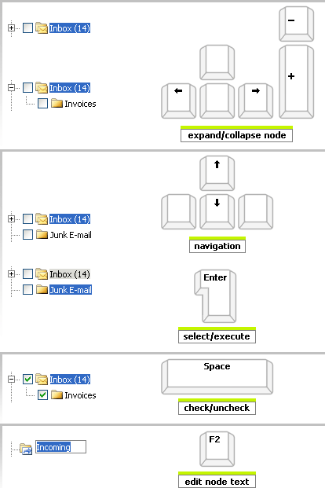

# Keyboard Support


This article demonstrates the usage and the advantages that the **RadTrewView** provides through its keyboard support. A critical requirement for software accessibility is keyboard support as a complete alternative to pointing devices (mouse, etc.). Keyboard support is comprised of command key, focus key, keyboard navigation and key commands.

**RadTreeView** provides two aspects of keyboard support:

## Focus the control 

A key combination that allows the end-user to focus on the respective **RadTreeView** and subsequently use the arrow keys for navigation. 


**Example 1**: Setting the KeyboardNavigationSettings for **RadTrewView**

````ASPNET
<telerik:RadTreeView RenderMode="Lightweight" ID="RadTreeView1" runat="server" >
    <KeyboardNavigationSettings CommandKey="Alt" FocusKey="W" />
</telerik:RadTreeView>
````

The **KeyboardNavigationSettings** exposes two properties to configure the keyboard combination that sets focus to the control: 

* **FocusKey**: An upper-case letter or number.

* **CommandKey**: [Ctrl] , [Alt] or [Shift].

Pressing the keys set to these two properties at the same time places the focus on the TreeView. The user can then use the arrow keys for navigation. 


>note Note that in some browsers certain keyboard combinations are already occupied and used by the browser itself. 
>

## Arrow Key Navigation and Key Commands

Allows end-users to navigate around the TreeView structure using the arrow keys, as well as to use the **Plus**, **Minus**, **Space**, **Enter**, and **F2** keys for additional control:

* The **Left Arrow** will collapse the current node or navigate to the parent node if the current node is already collapsed.

* The **Right Arrow** will expand the current node or navigate to the first child node if the current node is already expanded.

* The **Plus/Minus** keys will expand/collapse the current node.

* The **Up/Down** arrows will move the node selection one node up/down respectively.

* The **Enter** key will select the node and fire its event.

* Typing a letter key moves focus to the next instance of a visible node whose title begins with that letter.

* The **Space** key will check/uncheck the current node (in case it has a checkbox).

* **Home** key moves to the top node in the TreeView.

* **End** key moves to the last visible node in the TreeView.

* **Ctrl + Arrow** to an item with the keyboard focuses the item (but does not select it). Previous selections are maintained, provided that the **Ctrl** key is not released or that some other keyboard function is not performed.

* **Shift + Up Arrow** extends selection up one node.

* **Shift + Down Arrow** extends selection down one node.

* **Shift + Home** extends selection up to the top-most node.

* **Shift + PageDown** extends selection down to the last node.

* **Ctrl + Space** with focus on an item toggles the selection of the item.

* **F2** key will make the node text editable (in case the **AllowNodeEditing** property is set to **true**). Click **Enter** to confirm, **Esc** to cancel.

* **(asterisk)** on keypad expands all nodes.

**Example 2**: Demonstration of some of the key Navigations of the **RadTrewView**.


>note The **RadTreeView** keyboard support is implemented according to the [W3C Specification. ](http://www.w3.org/TR/2010/WD-wai-aria-practices-20100916/#TreeView)
>

