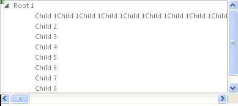

# Controlling Appearance


There are a number of ways you can customize the look & feel of your RadTreeView control:

## Dimensions

To change the basic dimensions of the RadTreeView:

* Use the __Height__ property to control the height of the TreeView. If you do not set __Height__, the TreeView list sizes itself automatically based on the number of items in the list. If the value of __Height__ is too small to display all of the items in the list, a vertical scroll bar appears.

* Set the __Width__ property to specify the width of the input area of the control. 
>caption 



## Look and Feel

* To change the overall look and feel of the RadTreeView, set the [Skin](A2ACD8E0-A5F3-4093-A5DA-FF45D737F6FA) property.

* To change the way the Nodes expand and collapse, use [Animation]().

* To change the look of an individual item in the RadTreeView, use its __CssClass__ property and set up the CSS styles as needed.

* To provide a [right-to-left look and feel](), set the attribute of the page HTML or set the dir attribute within a div tag.

* To toggle the display of lines connecting Nodes, use the [ShowLineImages property]().

## Changing the font size

To adjust the font sizes of all items in the RadTreeView, you should use the following CSS rule:

````ASPNET
	.RadTreeView,
	.RadTreeView a.rtIn,
	.RadTreeView .rtEdit .rtIn input
	{
	   font-size:14px;
	} 			
````


The declaration above increases the font size by 3px (since the default font size of the RadTreeView is 11px).

## Changing the spacing between tree Nodes

To change the space between the RadTreeView Nodes, you should use the following CSS rules:

````ASPNET
	 .RadTreeView .rtLI
	{
	   padding-bottom: 10px;
	}
	.RadTreeView .rtUL .rtUL
	{
	   margin-top: 10px;
	}
	.RadTreeView .rtLast
	{
	   padding-bottom: 0; /* prevent double-spacing */
	}     		
````


The declaration above adds a 10px space between the Nodes.

## Changing the Node lines

The Node lines of the RadTreeView can be adjusted by modifying the following lines:

````ASPNET
	.RadTreeView .rtLines .rtLI
	{
	   background:url('TreeView/NodeSpan.gif') repeat-y 0 0;
	}
	.RadTreeView .rtLines .rtFirst
	{
	   background:url('TreeView/FirstNodeSpan.gif') no-repeat 0 1.273em;
	}
	.RadTreeView .rtLines .rtLast,
	.RadTreeView .rtLines .rtLast .rtUL
	{
	   background:none;
	}
	.RadTreeView .rtLines .rtTop
	{
	   background:url('TreeView/TopLine.gif') 0 0 no-repeat;
	}
	.RadTreeView .rtLines .rtLast .rtTop
	{
	   background:url('TreeView/SingleLine.gif') 0 0 no-repeat;
	}
	.RadTreeView .rtLines .rtMid
	{
	   background:url('TreeView/MiddleLine.gif') 0 0 no-repeat;
	}
	.RadTreeView .rtLines .rtBot
	{
	   background:url('TreeView/BottomLine.gif') 0 0 no-repeat;
	} 		
````


The images, referenced by this CSS, have the following meaning:


>caption  

| Image file name | Purpose of image |
| ------ | ------ |
|TopLineMiddleLineBottomLine|The images for first item, for items between the first and the last, and for the last item.Their role is to add the line before each tree Node.|
|SingleLine|This image has the same role as the images, described above. Used only when there is only one root item (therefore no sibling Nodes and should be rendered differently)|
|FirstNodeFirstNodeSpan|Images, containing only vertical lines. Please note the difference, that FirstNodeSpan contains a very high image that is needed for the proper rendering of RadTreeView.|

It is advised to copy the line images from an existing skin and modify them, which will reduce image modification problems to a minimum.
