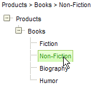

# Getting the Nodes Full Path


## 

To get the full path of a given node, walk the node hierarchy in reverse order using the client-side node object **get_parent()** method. Notice the statement within the while loop that checks if the **currentObject.get_parent()** is not null; this statement is only true when **currentObject** is a **Node**. As the loop climbs back up the tree, eventually **currentObject** is the **RadTreeView** client side object and calling **get_parent()** will return null.

````JavaScript
var s = node.get_text();
var currentObject = node.get_parent();
while (currentObject != null) {
    // get_parent() will return null when we reach the treeview
    if (currentObject.get_parent() != null) {
    	
    	if(!currentObject.get_text)
                        break;
        s = currentObject.get_text() + " > " + s;
    }
    currentObject = currentObject.get_parent();
} 
````


The following example demonstrates retrieving the full node path. The main logic resides in the [OnClientMouseOver]() event. The arguments passed into the event provide a reference to the currently selected node. The node is traversed in reverse order and a string containing the text path is built up. Finally the text is assigned to the **innerHTML** of a div for display above the **RadTreeView**.




````ASPNET
<form id="form1" runat="server">
<asp:ScriptManager ID="ScriptManager1" runat="server" />
<div>
	<div id="pathText" class="RadTreeView_Hay" style="height: 20px">
	</div>
	<telerik:RadTreeView RenderMode="Lightweight" ID="RadTreeView2" runat="server" OnClientMouseOver="onMouseOver"
		OnClientMouseOut="onMouseOut" Skin="Hay">
		<Nodes>
			<telerik:RadTreeNode runat="server" Text="Products" ExpandMode="ClientSide">
				<Nodes>
					<telerik:RadTreeNode runat="server" Text="Books" ExpandMode="ClientSide">
						<Nodes>
							<telerik:RadTreeNode runat="server" Text="Fiction">
							</telerik:RadTreeNode>
							<telerik:RadTreeNode runat="server" Text="Non-Fiction">
							</telerik:RadTreeNode>
							<telerik:RadTreeNode runat="server" Text="Biography">
							</telerik:RadTreeNode>
							<telerik:RadTreeNode runat="server" Text="Humor">
							</telerik:RadTreeNode>
						</Nodes>
					</telerik:RadTreeNode>
				</Nodes>
			</telerik:RadTreeNode>
		</Nodes>
	</telerik:RadTreeView>
</div>
</form>
````
````JavaScript
function onMouseOver(sender, args) {
    var node = args.get_node();
    var s = node.get_text();
    var currentObject = node.get_parent();
    while (currentObject != null) {
        // get_parent() will return null when we reach the treeview
        if (currentObject.get_parent() != null) {
            s = currentObject.get_text() + " > " + s;
        }
        currentObject = currentObject.get_parent();
    }
    var tbPath;
    tbPath = $get("pathText");
    tbPath.innerHTML = s;
}
function onMouseOut(sender, args) {
    $get("pathText").innerHTML = "";
}
````


# See Also

 * [RadTreeNode]()
