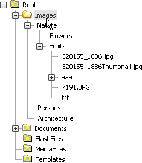
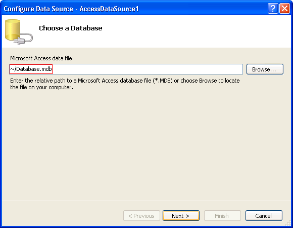
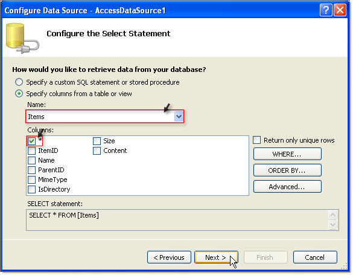

# Tutorial on Using DataBindings to Create a Hiearchical TreeView


## 

The following tutorial demonstrates how DataBindings can be used to map data individually to each level of nodes. The data bindings **Depth** property controls which **RadTreeView** node level the bindings properties are mapped to. In the example below there are four bindings. The first binding does not define **Depth** and so the properties for the binding are the default. This first binding defines the **TextField** and **ValueField** properties. The second and third binding have **Depth** properties set to "0" and "1", i.e. the root and the first level of child nodes. These two bindings define the **TextField**, **ImageUrl** and **HoveredImageUrl**. **ImageUrl** and **HoveredImageUrl** are defined with literal paths to icon image files. The last binding has **Depth** as "4" and maps the **ToolTipTextField** to the "Size" column in the database.




1. In a new AJAX-Enabled Web Application, drop a **RadTreeView** onto the default form.

1. Locate the "Database.mdb" Access database in the RadControls for ASP.NET AJAX suiteversion installation directory under \Live Demos\App_Data. The typical path is something like the following: \Telerik\RadControls for ASPNET <current version>\Live Demos\App_Data\Database.mdb

1. Drag the "Database.mdb" file to the project in the Solution Explorer. 


1. Open the [Smart Tag]() and set the **Skin** to **Vista** from the drop down list. Then select **<New data source...>** from the **Choose Data Source** drop down list. *This step will display the Data Source Configuration Wizard.*


1. In the Data Source Configuration Wizard, "Choose a Data Source Type" page, select the **Access Database** icon and click the **OK** button. *This step will display the Configure Data Source Wizard.*


1. In the "Choose a Database" page, Microsoft Access Data File text box enter "~/Database.mdb". Click the **Next** button to continue.


1. In the "Configure the Select Statement" page of the wizard, choose "Items" from the drop down list. In the Columns area check the "*" to include all columns. Click the **Next** button.


1. In the Solution Explorer, drag two icon images files to the project. For the purposes of this example the files are named "folderclosed.ico" and "folderopen.ico".

1. In the Properties Window set **DataFieldID** to "ItemID" and the **DataFieldParentID** to "ParentID".

1. Open the RadTreeView Smart Tag and select the **Edit RadTreeView DataBindings** link. *This step will display the **NavigationItemBinding Collection Editor**

1. In the **NavigationItemBinding Collection Editor** click the Add button four times to create four **RadTreeNodeBinding** objects. Set the properties for the RadTreeNodeBinding objects in order as follows:
    * **TextField**: "Name", **ValueField**: "ItemID".
    * **Depth**: 0, **HoveredImageUrl**: "folderopen.ico", **ImageUrl**: "folderclosed.ico", **TextField**: "Name".
    * **Depth**: 1, **HoveredImageUrl**: "folderopen.ico", **ImageUrl**: "folderclosed.ico", **TextField**: "Name".
    * **Depth**: 4, **TextField**: "Name", **ToolTipField**: "Size".The ASP.NET markup should look like the example below:
    ````ASPNET
<telerik:RadTreeView ID="RadTreeView1" runat="server" DataSourceID="AccessDataSource1"
    DataFieldID="ItemID" DataFieldParentID="ParentID" LoadingStatusPosition="BeforeNodeText">
    <DataBindings>
        <telerik:RadTreeNodeBinding TextField="Name" ValueField="ItemID" />
        <telerik:RadTreeNodeBinding Depth="0" TextField="Name" HoveredImageUrl="folderopen.ico"
            ImageUrl="folderclosed.ico" />
        <telerik:RadTreeNodeBinding Depth="1" TextField="Name" HoveredImageUrl="folderopen.ico"
            ImageUrl="folderclosed.ico" />
        <telerik:RadTreeNodeBinding Depth="4" TextField="Name" ToolTipField="Size" />
    </DataBindings>
</telerik:RadTreeView>
````


1. Click the OK button to close the **NavigationItemBinding Collection Editor.**

1. Press **F5** to run the application. Move the mouse over first and second level nodes to observe the image change. Hover the mouse above the fourth level nodes to observe the size displayed in the tool tip.
