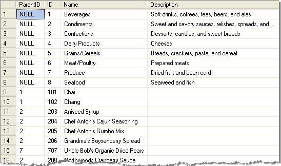
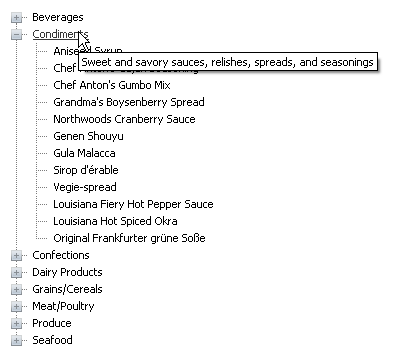

# Binding to Hierarchical Data


## 

Minimally, to bind hierarchical data you must assign the **DataSource, DataFieldID**, **DataFieldParentID**and **DataTextField**properties of the RadTreeView. Optionally, you can assign the **DataValueField**property.

The following example binds to a query of the Northwind database Categories and Products tables that are joined so that they form a hierarchy. The raw data from the query looks something like the example below.

>tip You can also use the Database.mdb Access file found in the RadControls installation directory under \Live Demos\App_Data. This Access file is already in a hierarchical structure and can be queried directly without additional manipulation in the join. Also, see[Getting Started, Binding to a Database]()for more examples.
>


>caption 



When bound to the RadTreeView the application looks like the screenshot below.


>caption 



In the **BindToDataTable()** method below, the hierarchical query is created, loaded into the DataTable and assigned to the **DataSource** property of the RadTreeView. The "Name" of the category or product is assigned to the **DataTextField**for display in the TreeView. The **DataFieldParentID**property is assigned null, for top level categories, or the id of the category. A unique identifier must be assigned to the **DataFieldID**; in this case the identifier is the CategoryID or a number constructed from the CategoryID and ProductID combined. Optionally, you can assign the **DataValueField**. Also, you can optionally create a handler for the **NodeDataBound**event and use any of the bound columns; in this example the Description column is assigned to the Node **ToolTip**property.


````C#
	using System.Data.SqlClient;
	using Telerik.Web.UI;
	namespace RadTreeView_DataBindDataTable
	{    
	    public partial class _Default : System.Web.UI.Page    
	    {        
	        protected void Page_Load(object sender, EventArgs e)         
	        {             
	            if (!IsPostBack)             
	            {                 
	                BindToDataTable(RadTreeView1);             
	            }         
	        }
	
	        private void BindToDataTable(RadTreeView treeView)        
	        {            
	            const string sql = "select ParentID = null, ID = CategoryID, Name = CategoryName, Description from Categories " + "union all " + "select ParentID = CategoryID, ID = (CategoryID * 100) + ProductID, Name = ProductName,  Description = '' from Products";                        
	            SqlConnection connection = new SqlConnection(Properties.Settings.Default.NwindConnectionString);
	            SqlDataAdapter adapter = new SqlDataAdapter(sql, connection);
	            DataTable dataTable = new DataTable();
	            adapter.Fill(dataTable);
	            treeView.DataTextField = "Name";
	            treeView.DataValueField = "Description";
	            treeView.DataFieldID = "ID";
	            treeView.DataFieldParentID = "ParentID";
	            treeView.DataSource = dataTable;
	            treeView.DataBind();
	        }
	
	        protected void RadTreeView1_NodeDataBound(object sender, RadTreeNodeEventArgs e)       
	        {             
	            e.Node.ToolTip = (e.Node.DataItem as DataRowView)["Description"].ToString();
	        }    
	    }
	}
				
````
````VB.NET
	Imports System.Data.SqlClient
	Imports Telerik.Web.UI
	
	Namespace RadTreeView_DataBindDataTable
	    Public Partial Class _Default Inherits System.Web.UI.Page
	            Protected Sub Page_Load(ByVal sender As Object, ByVal e As EventArgs)
	                If Not IsPostBack Then
	                    BindToDataTable(RadTreeView1)
	                End If
	            End Sub
	
	            Private Sub BindToDataTable(ByVal treeView As RadTreeView)
	                Const sql As String = "select ParentID = null, ID = CategoryID, Name = CategoryName, Description from Categories " + "union all " + "select ParentID = CategoryID, ID = (CategoryID * 100) + ProductID, Name = ProductName, Description = '' from Products"
	
	                Dim connection As New SqlConnection(Properties.Settings.[Default].NwindConnectionString)
	                Dim adapter As New SqlDataAdapter(sql, connection)
	                Dim dataTable As New DataTable()
	
	                adapter.Fill(dataTable)
	
	                treeView.DataTextField = "Name"
	                treeView.DataValueField = "Description"
	                treeView.DataFieldID = "ID"
	                treeView.DataFieldParentID = "ParentID"
	                treeView.DataSource = dataTable
	                treeView.DataBind()
	            End Sub
	
	            Protected Sub RadTreeView1_NodeDataBound(ByVal sender As Object, ByVal e As RadTreeNodeEventArgs)
	                e.Node.ToolTip = (TryCast(e.Node.DataItem, DataRowView))("Description").ToString()
	            End Sub
	        End Class
	    End Namespace
	
	
````


For a live example of binding to hierarchical data see [Hierarchical Data Binding](http://demos.telerik.com/aspnet-ajax/TreeView/Examples/Programming/DataBinding/DefaultCS.aspx).


