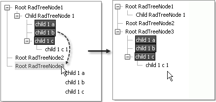

# Drag and Drop Overview


## 

To allow drag and drop functionality in **RadTreeView**, set the **EnableDragAndDrop** property to **True**. Once enabled, dragging behavior by default allows Nodes to be dropped on other Nodes but not between Nodes. Setting **EnableDragAndDropBetweenNodes** to **True** allows Nodes to be dropped between other Nodes. A line between the Nodes will display briefly as a visual indicator that the Node can be dropped in the location of the line. To allow multiple Nodes to be dragged at one time, set the **MultipleSelect** property to **True**.

You can further tailor the drag and drop behavior per Node by setting the boolean **RadTreeNode** properties **AllowDrag** and **AllowDrop**. Both **AllowDrag** and **AllowDrop** properties are **True** by default.

When **RadTreeView** detects a valid drag and drop operation (the selected Node is dropped onto another Node or in between Nodes) it generates a **NodeDrop** server-side event. The event is sent to the source TreeView, i.e. the TreeView from which the Node is being dragged. The event handler for **NodeDrop** can then perform specific action, by fetching both the source and destination drag/drop Nodes. In the **NodeDrop** event handler the **RadTreeNodeDragDropEventArgs** parameter provides access to the following objects:

* **SourceDragNode**: The Node being dragged;

* **DestDragNode**: The Node being dragged to;

* **DraggedNodes**: A collection of Nodes being dragged (this is useful when multi-selection is enabled - **MultiSelect** property of the **RadTreeView** is set to **True**);

* **DropPosition**: Indicates the relationship of the Nodes being dropped and can be a **RadTreeViewDropPosition** enumeration value **Above**, **Below** or **Over**;

* **HtmlElementID**: The ID of the HTML element that the Node is being dropped on.

The following example handles the **OnNodeDrop** event and adds the **DraggedNodes** to the **DestDragNode** **Nodes** collection.




````ASPNET
<telerik:RadTreeView RenderMode="Lightweight" ID="RadTreeView1" runat="server" EnableDragAndDrop="true" EnableDragAndDropBetweenNodes="true"
    MultipleSelect="true" OnNodeDrop="RadTreeView1_NodeDrop" Skin="Vista">
    <Nodes>
        <telerik:RadTreeNode runat="server" Text="Root RadTreeNode1" ExpandMode="ClientSide">
            <Nodes>
                <telerik:RadTreeNode runat="server" Text="Child RadTreeNode 1" ExpandMode="ClientSide">
                    <Nodes>
                        <telerik:RadTreeNode runat="server" ExpandMode="ClientSide" Text="child 1 a">
                        </telerik:RadTreeNode>
                        <telerik:RadTreeNode runat="server" ExpandMode="ClientSide" Text="child 1 b">
                        </telerik:RadTreeNode>
                        <telerik:RadTreeNode runat="server" ExpandMode="ClientSide" Text="child 1 c">
                            <Nodes>
                                <telerik:RadTreeNode runat="server" ExpandMode="ClientSide" Text="child 1 c 1">
                                </telerik:RadTreeNode>
                            </Nodes>
                        </telerik:RadTreeNode>
                    </Nodes>
                </telerik:RadTreeNode>
            </Nodes>
        </telerik:RadTreeNode>
        <telerik:RadTreeNode runat="server" Text="Root RadTreeNode2" ExpandMode="ClientSide">
        </telerik:RadTreeNode>
        <telerik:RadTreeNode runat="server" Text="Root RadTreeNode3" ExpandMode="ClientSide">
        </telerik:RadTreeNode>
    </Nodes>
</telerik:RadTreeView>
````
````C#
using Telerik.Web.UI;
using Telerik.Web.UI;
namespace RadTreeView_Dragging
{
   public partial class _Default : System.Web.UI.Page
   {
       protected void RadTreeView1_NodeDrop(object sender, Telerik.Web.UI.RadTreeNodeDragDropEventArgs e)
       {
           foreach (RadTreeNode node in e.DraggedNodes)
           {
               e.DestDragNode.Nodes.Add(node);
           }
       }
   }
} 			
````
````VB.NET
Imports Telerik.Web.UI
Namespace RadTreeView_Dragging
    Partial Public Class _Default
        Inherits System.Web.UI.Page
        Protected Sub RadTreeView1_NodeDrop(ByVal sender As Object, ByVal e As Telerik.Web.UI.RadTreeNodeDragDropEventArgs)
            For Each node As RadTreeNode In e.DraggedNodes
                e.DestDragNode.Nodes.Add(node)
            Next
        End Sub
    End Class
End Namespace
````


To see a live example of the drag and drop support of **RadTreeView** visit the [Drag & Drop live demo](http://demos.telerik.com/aspnet-ajax/TreeView/Examples/Functionality/DragAndDropNodes/DefaultCS.aspx).

# See Also

 * [Overview]()

 * [NodeDrop]()
