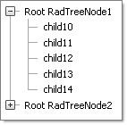
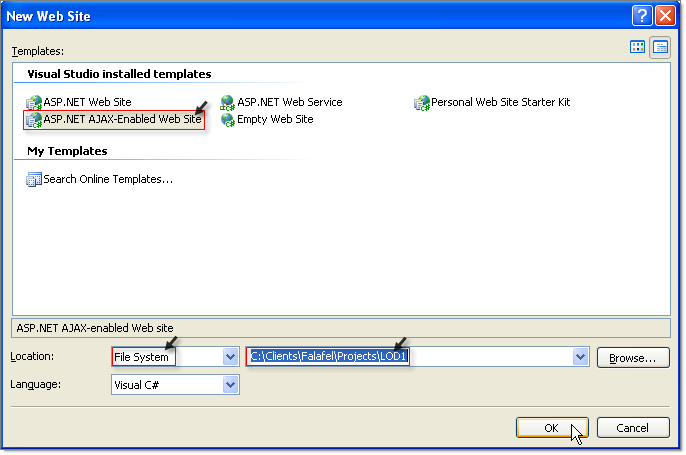
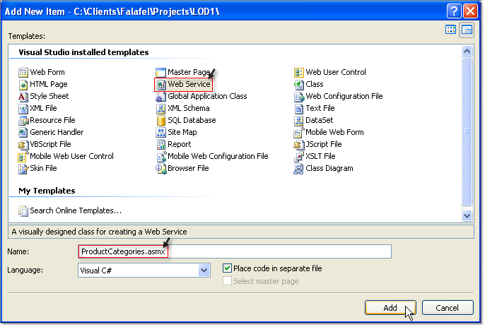

# Tutorial on Web Service Binding


## 

The following tutorial demonstrates how to create a web service that can be consumed by the **RadTreeView** load-on-demand feature.


>caption 



1. Create an AJAX-Enabled Web Site by selecting the Visual Studio menu **File | New | Web Site.**

1. Select the **ASP.NET AJAX-Enabled Web Site** option, set the **Location** to **File System** and enter a path for the web site. Click OK to close the New Web Site dialog.


1. Drop a **RadTreeView** control from the Toolbox to the default page.
	````ASPNET
<telerik:RadTreeView ID="RadTreeView1" runat="server" Width="300px">
    <WebServiceSettings Path="ProductCategories.asmx" Method="GetTreeViewCategories" />
    <Nodes>
        <telerik:RadTreeNode Text="Products" Value="1" ExpandMode="WebService">
        </telerik:RadTreeNode>
        <telerik:RadTreeNode Text="Purchase" Value="132" ExpandMode="WebService">
        </telerik:RadTreeNode>
        <telerik:RadTreeNode Text="Support" Value="141" ExpandMode="WebService">
        </telerik:RadTreeNode>
        <telerik:RadTreeNode Text="Community" Value="155" ExpandMode="WebService">
        </telerik:RadTreeNode>
        <telerik:RadTreeNode Text="Corporate" Value="164" ExpandMode="WebService">
        </telerik:RadTreeNode>
    </Nodes>
</telerik:RadTreeView>
````


1. In the Solution Explorer, right click the project and select **Add ASP.NET Folder | App_Code** from the context menu.

1. In the Solution Explorer, right click the project and select **Add New Item** from the context menu. From the **Add New Item** dialog Select **Web Service,** name the service "ProductCategories.asmx" and click **Add** to close the dialog.


1. In Solution Explorer, locate ProductCategories.cs in the App_Code folder. Replace the code with the code below.
	````C#
public RadTreeNodeData[] GetTreeViewCategories(RadTreeNodeData node, object context)
{
	node.Text; //returns the node's text
    node.Value; //returns node's value
    
	DataTable productCategories = GetProductCategories(node.Value);
    List<RadTreeNodeData> result = new List<RadTreeNodeData>();
    foreach (DataRow row in productCategories.Rows)
    {
        RadTreeNodeData itemData = new RadTreeNodeData(); 
        itemData.Text = row["Title"].ToString(); 
        itemData.Value = row["CategoryId"].ToString();
        if (Convert.ToInt32(row["ChildrenCount"]) > 0) 
        { 
            itemData.ExpandMode = TreeNodeExpandMode.WebService; 
        }
        result.Add(itemData);
    }
    return result.ToArray();
}
````
	````VB.NET
Public Function GetTreeViewCategories(ByVal node As RadTreeNodeData, ByVal context As Object) As RadTreeNodeData()
	
	node.Text 'returns the node's text
	node.Value 'returns node's value
	
    Dim productCategories As DataTable = GetProductCategories(node.Value)
    Dim result As New List(Of RadTreeNodeData)()
    For Each row As DataRow In productCategories.Rows
        Dim itemData As New RadTreeNodeData()
        itemData.Text = row("Title").ToString()
        itemData.Value = row("CategoryId").ToString()
        If Convert.ToInt32(row("ChildrenCount")) > 0 Then
            itemData.ExpandMode = TreeNodeExpandMode.WebService
        End If
        result.Add(itemData)
    Next
    Return result.ToArray()
End Function
````


>note You can access the **Text** and **Value** of the node, which is being expanded, from the **RadTreeNodeData** parameter passed to the web method.
>

1. In Solution Explorer, right click the default page and select **Set as Start Page** from the context menu.

1. Press F5 to run the web site. Click OK to enable debugging.
