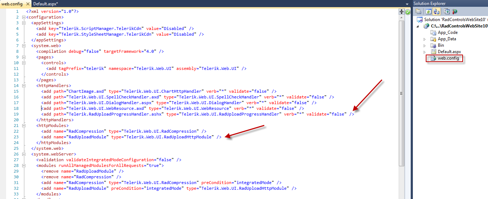
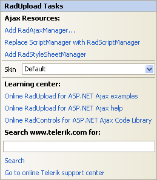
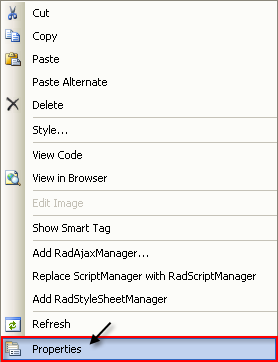
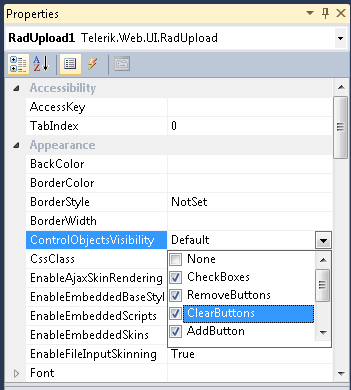
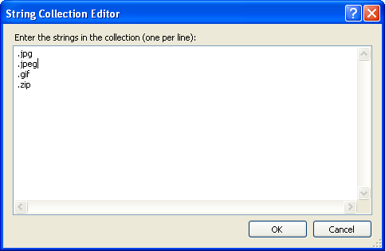
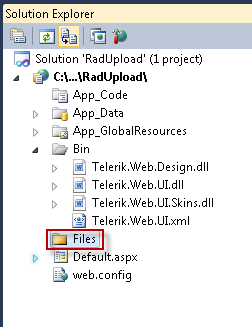
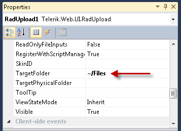
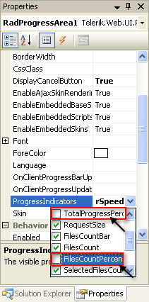
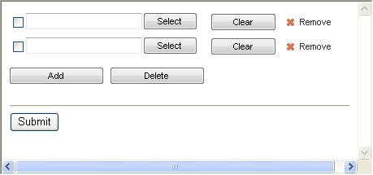
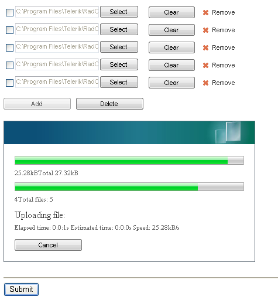

# Getting Started


>caution  **RadUpload** has been replaced by [RadAsyncUpload](http://demos.telerik.com/aspnet-ajax/asyncupload/examples/overview/defaultcs.aspx), Telerik’s next-generation ASP.NET upload component. If you are considering Telerik’s Upload control for new development, check out the [ documentation of RadAsyncUpload ](http://www.telerik.com/help/aspnet-ajax/asyncupload-overview.html) or the [control’s product page](http://www.telerik.com/products/aspnet-ajax/asyncupload.aspx). If you are already using **RadUpload** in your projects, you may be interested in reading how easy the transition to RadAsyncUpload is and how you can benefit from it [in this blog post](http://blogs.telerik.com/blogs/12-12-05/the-case-of-telerik-s-new-old-asp.net-ajax-upload-control-radasyncupload). The official support for **RadUpload** has been discontinued in June 2013 (Q2’13), although it is still be available in the suite. We deeply believe that **RadAsyncUpload** can better serve your upload needs and we kindly ask you to transition to it to make sure you take advantage of its support and the new features we constantly add to it.
>


This tutorial will walk you through creating a Web page that uses **RadUpload** controls. It shows how to:

* Use **RadUpload** to validate and upload files.

* Use **RadProgressArea** to display a progress dialog.

* Use skins to provide a consistent look & feel.

## Enabling RadProgressManager

Before you can use any of the **RadUpload** progress-monitoring controls, you must add **RadProgressManager**.

>note You can omit the below seven steps if you simply use the **SmartTag** of **RadProgressManager** 
>


1. In the Solution explorer, double-click the **Web.config** file to open it for editing:

	

1. Under the **`<configuration>`** element locate the **`<system.web>`** element. Add it if it does not exist.

1. Under the **`<system.web>`** element locate the **`<httpModules>`** element. Add it if it does not exist.

1. In the **`<httpModules>`** element add the following tag:

	````XML
	<add name="RadUploadModule" type="Telerik.Web.UI.RadUploadHttpModule, Telerik.Web.UI" />
	````

	This registers the **RadUploadHttpModule** type, which enables **RadProgressManager** to manage the upload progress.

	>note If the **controls** assembly is added in **GAC** you must specify the full assembly qualified path of the **RadUploadHttpModule** type. See the [Configuration](FAFFEB65-66D2-4CFE-8F40-E4BA471540A9) article for details.
	>


1. Under the **`<system.web>`** element, locate the **`<httpHandlers>`** element. Add it if it does not exist.

1. In the **`<httpHandlers>`** element, add the following tag:

	````XML
	<add verb="*" path="Telerik.RadUploadProgressHandler.ashx" type="Telerik.Web.UI.RadUploadProgressHandler, Telerik.Web.UI"
		validate="false" />
	````

	This registers the **RadUploadProgressHandler**, which is required by the **RadProgressManager** control.

	>note If you are hosting your application in IIS 7 with integrated mode, you should additionally register RadUpload in the modules and handlers sections like this:
	>


	````XML
	<system.webserver>  
		<modules>
		 . . .      
			<add name="RadUploadModule" type="Telerik.Web.UI.RadUploadHttpModule, Telerik.Web.UI" preCondition="integratedMode"/>  
		</modules>
		<handlers>
		 . . .
			<add name="Telerik_RadUploadProgressHandler_ashx" path="Telerik.RadUploadProgressHandler.ashx" verb="*" type="Telerik.Web.UI.Upload.RadUploadProgressHandler, Telerik.Web.UI" preCondition="integratedMode"/>
		</handlers>
	</system.webserver>
	````


	>note If the **controls** assembly is added in **GAC** you must specify the full assembly qualified path of the **RadUploadProgressHandler** type. See [RadUploadProgressHandler](FAFFEB65-66D2-4CFE-8F40-E4BA471540A9) for details.
	>


1. At this point, your Web.config should look as follows:

````XML
<configuration>
  ...  
  <system.web>
      <httpHandlers>
            <add verb="*" path="Telerik.RadUploadProgressHandler.ashx" type="Telerik.Web.UI.RadUploadProgressHandler, Telerik.Web.UI" />
            ...
      </httpHandlers>
      <httpModules>
           <add name="RadUploadModule" type="Telerik.Web.UI.RadUploadHttpModule, Telerik.Web.UI" />
           ...
      </httpModules>
           ...
  </system.web>

</configuration>
````


## Adding a RadUpload control

1. In the designer, drag a **RadUpload** control from the toolbox onto your page. The **RadUpload** [Smart Tag]() should appear automatically:

	

1. In the **Skin** drop-down control, select the "Vista" skin, to provide the basic look & feel of your upload control.

	

1. Right click on the **RadUpload** control, and choose **Properties** from its context menu:

	

1. In the **Appearance** section of the properties pane, locate the **ControlObjectsVisibility** property. This lets you configure what controls are associated with each input area of the **RadUpload** control. Drop down the list and check the **ClearButtons** item, so that all the possible controls are checked:

	

1. In the **Behavior** section of the properties pane, click the ellipsis button next to the **AllowedFileExtensions** property. This displays the string collection editor. Add the file extensions for the file types you want to allow:

	

1. Set the following additional properties in the **Behavior** section:

	* Set **InitialFileInputsCount** to 2. This configures the **RadUpload** control to start by showing 2 input areas.

	* Set the **MaxFileInputsCount** to 5. This configures the **RadUpload** control so that it never shows more than 5 input areas.

	* Set the **MaxFileSize** to 1000000. This specifies that the **RadUpload** should not upload a file of more than 1,000,000 bytes.

	>note By default, your application can upload at most 4 megabytes of data over all the files uploaded in a single postback.
	>


1. In the Solution Explorer, add a new folder called "Files" where the uploaded files will be placed:

	

1. In the properties pane for the **RadUpload** control set the **TargetFolder** property to "~/Files". This tells the RadUpload control to automatically save uploaded files into the "Files" folder you created.

	

## Adding a RadProgressArea control

If the user tries to upload a lot of large files, the process can take a while. Adding a **RadProgressArea** control automatically causes your Web page to display a progress dialog while files are uploaded.

1. Drag a **RadProgressManager** control from the toolbox onto your Web page. The **RadProgressManager** is required for progress monitoring.

1. Drag a **RadProgressArea** control from the toolbox onto your Web page. The **RadProgressArea** control is responsible for displaying the progress dialog while files are uploaded. It operates automatically, whenever an update control on the page starts to upload files.

1. In the **RadProgressArea** [Smart Tag]() that appears automatically, choose "Vista" from the drop-down list for the **Skin** property, so that the dialog matches the skin for the **RadUpload** control.

1. In the properties pane for the **RadProgressArea** control, locate the **DisplayCancelButton** property. Set it to **True**, so that the user can cancel an upload that is taking a long time.

1. Locate the **ProgressIndicators** property, drop down its list, and uncheck "TotalProgressPercent" and "FilesCountPercent". This removes the percentage values from the figures that the progress dialog reports.

	

## File Submission

1. Drag a **Horizontal Rule** from the **HTML** section of the toolbox onto your Web page below the **RadUpload** control.

1. Drag a **Button** from the **Standard** section of the toolbox below the horizontal rule. Set its Text property to "Submit".

1. Since on localhost the upload speed is pretty fast (like 5mb/s) one needs to upload file larger than 15-20mb in order to trigger the progress area. If you do not see the progress this usually means that the file is too small and it is uploaded before there is enough time for the area to show up.

1. Run the application. The **RadUpload** control appears, showing two file input areas:

	

1. Experiment with the input areas:

	* Use the **Select** buttons to locate files.

	* Use the **Clear** buttons to clear the selected files.

	* Use the **Remove** link to remove an entire file input area.

	* Use the **Add** button to add new file input areas.

	* Click the check box next to an item and click the **Delete** button to remove the selected input area.

1. When you have selected a number of files, including some with invalid extensions, click the **Submit** button to upload the files. The progress dialog appears:

	

1. When the page reloads after the postback, it is reset to the initial starting configuration.

1. Use the Windows explorer to look in the **Files** directory. Note that the uploaded files have been copied to that directory, except for the ones with invalid extensions.
