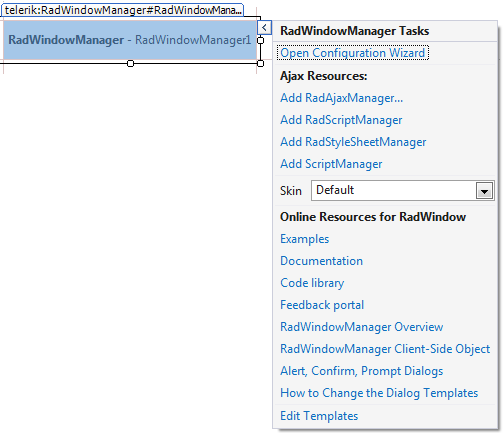

# Smart Tag

## RadWindow Smart Tag

The Smart Tag for **RadWindow** lets you easily change the skin for your **RadWindow** control or quickly get help. You can display the Smart Tag by right clicking on a **RadWindow** control and choosing "Show Smart Tag".

As of Q2 2015 we have improved the smart tags of our controls by displaying the most popular control specific properties and adding links to their important online resources:

>important To edit controls inside the `ContentTemplate` of a **RadWindow**
>
1. Click the **Edit Templates** link in the **RadWindow** Smart Tag.
1. When done, click the **End Template Editing** link in the **RadWindow** Smart Tag to ensure your changes will be applied and saved.

## Skin

The **Skin** drop-down displays a list of available [skins]() that you can apply to your **RadWindow**, along with an example of what the title bar looks like for each skin. Assign a skin by selecting the one you want from the list.

## Learning Center

Links navigate you directly to **RadWindow** Help and support forums.

## RadWindowManager Smart Tag

The Smart Tag for **RadWindowManager** is almost identical to that for **RadWindow**. It sets the **Skin** for the **RadWindowManager**, which controls the default behavior of all windows that the **RadWindowManager** contains, or lets you link to help for **RadWindowManager**. The only difference is that it also allows you to open the [visual Configuration Manager](). You can display the Smart Tag by right clicking on a **RadWindowManager** control and choosing "Show Smart Tag".

