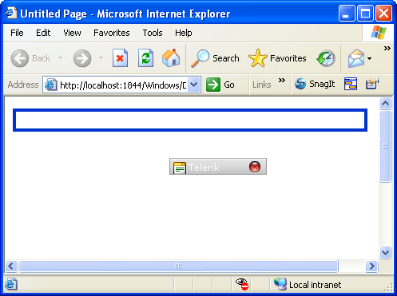
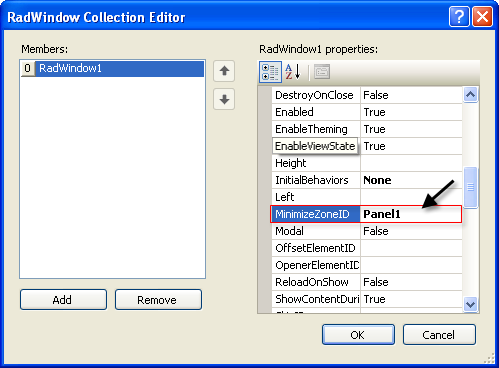
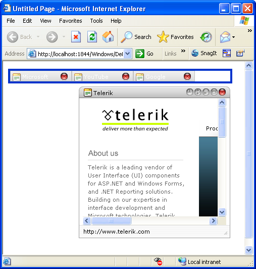

# Minimize Zone

## 

Popup windows in most Web applications can't be treated like regular windows. They may or may not allow resizing, and certainly not minimizing or maximizing.RadWindow-based popup windows can be minimized as long as the __Behaviors__ property includes "Minimize". By default, whenthe user clicks on the minimize icon on the window's title bar, the window isminimized in its current location:
>caption 

You can change this default behavior by providing your windows with an area that acts like a task bar. This area is called a minimize zone. The minimize zone can be any HTML element such as a div or Panel control. You can tailor the element to look like a task bar, to run vertically along the left side, or any other configuration you like.

To use use a minimize zone:

1. Add a control to your form that hold the minimized windows.

1. In the __RadWindowManager__ or __RadWindow__ control, set the __MinimizeZoneId__ property to the ID for	the control you added in step 1.
>caption 

>tip If you have several windows that all minimize to the same minimize zone, set the __MinimizeZoneID__ property of the __RadWindowManager__ rather than setting the property for each individual __RadWindow__ .
>

1. When you run the application, click on the Minimize button on your	windows. They move to the minimize zone:
>caption 

>tip To restore a minimized window, simply double-click on it. It returns to the size and position it held before it was minimized.
>

