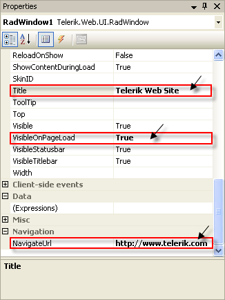
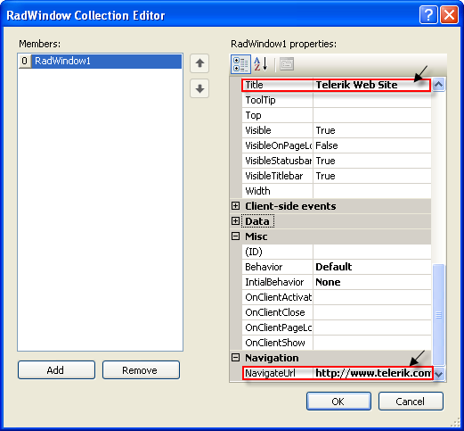
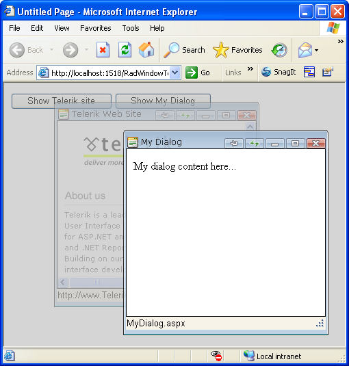
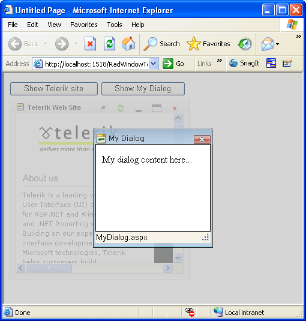

# Getting Started Overview

__RadWindow__ is a part of the Telerik UI for ASP.NET AJAX suite. It is a container that can display content from the same page	(when used as [controls container]()) or it can	[display a content page](), different from the parent one.	In the second case, the control uses an IFRAME and behaves like one.

This getting started article will walk you through creating a web page that shows how to:

* Start a __RadWindow__ when the web page first loads.
* Use a __RadWindowManager__ to manage multiple windows.
* Launch a __RadWindow__ when the user clicks on a control.
* Use skins to alter the appearance of a window.
* Create modal and non-modal windows.
* Specify the behavior and position of a window.

For more information on how to work with and control __RadWindow__, please check the [Client-Side]()/[Server-Side]() Programming sections in this documentation.

## Creating a Window on Startup

1. To create a RadWindow, drag a __RadWindow__ control from the Visual Studio Toolbox onto an existing form.

1. In the Behavior section of the Properties menu, set the __Title__ property to "Telerik Web Site".

1. Set the __VisibleOnPageLoad__ property to __True__.

	>warning This property is used to make the example simpler. The[Opening from the server]()help article explains how to open a RadWindow with server code in more detail, as well as the implications of the __VisibleOnPageLoad__ property and when it should __not__ be used.

1. In the Navigation section, set the __NavigateUrl__ property to __http://www.telerik.com__

	

1. Press F5 to run the application.

You should see the window pop up immediately. Experiment with the window by moving it on the form, using the "pin" button, maximizing and restoring it, and finally closing the window.

## Using RadWindowManager with Multiple Windows

Although you can use __RadWindow__ controls directly, if you are working with multiple __RadWindow__ controls it is a good idea to use a __RadWindowManager__ control. It allows you to create __RadWindow instances dynamically - with JavaScript__ alone, without as much as a postback. Also, it can be used at a __central place to set the common properties for all dialogs it opens__, thus minimizing the configuration steps you need to perform.

You'll now modify the previous example to delete the __RadWindow__ you just created and use a	__RadWindowsManager__ control to host two __RadWindow__ controls.

1. Delete the __RadWindow__ control from your form. You will now use a __RadWindowManager__ to create the __RadWindow__ controls instead.

1. Drag a __RadWindowManager__ from the Toolbox onto your form.

1. Expand the __Misc__ section of the Properties window, find the __Windows__ property and click on the	__ellipsis__ button to display the [RadWindow Collection Editor]().

1. In the RadWindow Collection Editor, click the __Add__ button to create a new __RadWindow__ control.Use the Properties pane to set its properties to match those of the window you created before:
	* Set the __Title__ property to "Telerik Web Site".
	* Set the __NavigateUrl__ property to __http://www.telerik.com__
	* Do __not__ set the __VisibleOnPageLoad__ property this time.
		

1. Click the __Add__ button again to create another __RadWindow__ control. Use the Properties pane to set the following properties:
	* Set the __ID__ property to "rwDialog".
	* Set the __Modal__ property to __True__.

1. Click __Ok__ to exit the RadWindow Collection Editor for now.

## Creating a Form for the Dialog

Before continuing with the multiple window example, you need to create a dialog form for the second __RadWindow__.

1. In the Solution Explorer, right-click on the project and choose __Add New Item__ to display the Add New Item dialog box	.

1. Add a new Web Form, giving it the name __"MyDialog.aspx"__.

1. In the body of the Web Form, enter the literal text __"My dialog content here..."__.

1. Move to the __Source__ view and change the title for this form to __"My Dialog"__. The markup should look similar to this:

	**ASP.NET**	     
	
		<head runat="server">
		  <title>My Dialog</title>
		</head>
		<body>
		  <form id="form1" runat="server">
		  

			My dialog content here...

		  </form>
		</body>

## Launching Windows from Another Control

1. Return to your default form and add a __Button__ control from the Standard section of the toolbox. Set its properties as follows:
	* Set the __ID__ property to __"btnTelerik"__.
	* Set the __Text__ property to __"Show Telerik site"__.

1. Copy the __Button__ control to create a second __Button__. Set its __ID__ property to __"btnDialog"__ and its __Text__ property to __"Show My Dialog"__.

1. Select the __RadWindowManager__, and use the __Windows__ property to bring up the RadWindow Collection editor again.
	* Select the first __RadWindow__ in the collection and set its __OpenerElementId__ property to __"btnTelerik"__.
		>note The __OpenerElementId__ property requires the __ClientID__ of the HTML element	that will open the __RadWindow__ when clicked.
	* Select the second __RadWindow__ in the collection (rwDialog), and set its __OpenerElementID__ property to __"btnDialog"__. Set its __NavigateUrl__ property to __"MyDialog.aspx"__.
		>tip There are other ways to open a dialog and they are explained in the [Opening Windows]() help article.
	* Click __Ok__ to exit the dialog.

1. Right-click the __RadWindowManager__ control and select __"Show Smart Tag"__.Use the Smart Tag to set the __Skin__ to __"Vista"__.

1. Press __F5__ to run the application. Click both buttons to bring up both windows. They both get the "Vista" look from the __RadWindowManager__ skin. Note the differences in behavior. The "Telerik Web Site" window gets its title from the __RadWindow__ control, while "My Dialog" gets its title from the HTML markup of MyDialog.aspx. The "Telerik Web Site" window is not modal, while "My Dialog" is modal.

1. Exit the application.

## Altering the appearance and behavior of individual windows

1. Select the __RadWindowManager__, and use the __Windows__ property to bring up the RadWindow Collection editor again.

1. Select the first __RadWindow__ control in the list (the "Show Telerik site" window).
	* Set its __Skin__ property to "Default 2006".
	* Set its __Top__ property to 30 and its __Left__ property to 0.
	* Set its __OffsetElementId__ property to "btnTelerik".
	* Set its __VisibleStatusBar__ property to __False__.

1. Select the second __RadWindow__ control in the list (the "Show My Dialog" window).
	* Set its __Behaviors__ property to "Close, Move".
	* Set both its __Height__ and __Width__ properties to 200.

1. Click Ok to exit the Collection editor.

1. Run the application.
	* Click the "Show Telerik site" label. The window appears 30 pixels below the label you clicked. (If you had not set an OffsetElementId, its position would be relative to the upper left corner of the web page instead of to the label.) Note that the window title bar has changed its appearance to reflect the new skin and that there is no status bar.
	* Click the "Show My Dialog" label. Note that this window still reflects the skin you set in the __RadWindowManager__. The title bar has lost all controls except the close button. Note that you can move the window, but not resize it from the 200 by 200 size you set in the designer.

## See Also

 * [Using RadWindow as Controls Container]()

 * [Opening Windows]()
