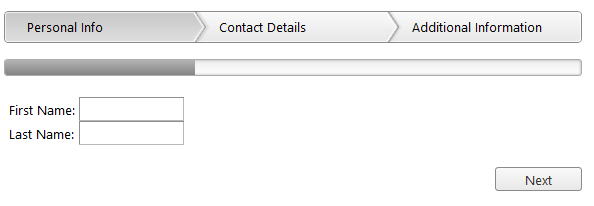

# Getting Started


The following tutorial demonstrates how you can add a **RadWizard** control with three steps. The end result will be similar to **Figure 1**:
>caption Figure 1: RadWizard with three steps.



## 

1. Add a **ScriptManager** control on a Web Form.

1. Add a **RadWizard** control on this AJAX-enabled Web Form: **Example 1**: Declaration of a **RadWizard** control:

````ASPNET
 <telerik:RadWizard RenderMode="Lightweight" ID="RadWizard2" runat="server" Width="550px">
	<WizardSteps>
		<telerik:RadWizardStep Title="Personal Infor">
			<telerik:RadTextBox RenderMode="Lightweight" ID="FirstNameTextBox" Label="First Name:" runat="server"></telerik:RadTextBox>
			<br />
			<telerik:RadTextBox RenderMode="Lightweight" ID="LastNameTextBox" Label="Last Name:" runat="server"></telerik:RadTextBox>                  
		</telerik:RadWizardStep>
		<telerik:RadWizardStep Title="Contact Details">
		</telerik:RadWizardStep>
		<telerik:RadWizardStep Title="Additional Information">
		</telerik:RadWizardStep>
	</WizardSteps>
</telerik:RadWizard>
````


