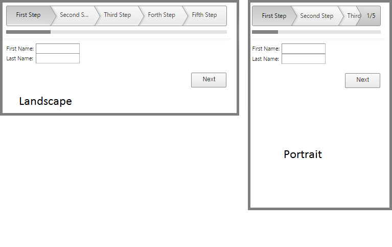

# Mobile Rendering


This article explains the __Mobile Rendering__ of __RadWizard__ control.

The RadWizard __Mobile__ rendering mode is specifically designed to be used in mobile devices where its behavior is relatively different from the one on a desktop device. This is controlled through their __RenderMode__ property.

## Mobile Rendering

With the Mobile rendering of the RadWizard you will have a specific functionality: to display the current active step index. This functionality will be enabled automatically only when the sum of each WizardStep width exceeds the overall RadWizard width. In this case the control shows a horizontal scroll bar in order to navigate to specific step that is not visible at the moment. In the upper right corner of the screen there is a little box displaying the active step index as shown in the screen shot below.
>caption Figure 1. Appearance of the RadWizard mobile render mode


__Example 3__: How to set the mobile rendering for the RadWizard.

````ASPNET
	            <telerik:RadWizard ID="RadWizard5" runat="server" Width="500px" RenderMode="Mobile">
	                <WizardSteps>
	                    <telerik:RadWizardStep Title="First Step">
	                        <telerik:RadTextBox ID="RadTextBox9" Label="First Name:" runat="server"></telerik:RadTextBox>
	                        <br />
	                        <telerik:RadTextBox ID="RadTextBox10" Label="Last Name:" runat="server"></telerik:RadTextBox>
	                    </telerik:RadWizardStep>
	                    <telerik:RadWizardStep Title="Second Step">
	                    </telerik:RadWizardStep>
	                    <telerik:RadWizardStep Title="Third Step">
	                    </telerik:RadWizardStep>
	                    <telerik:RadWizardStep Title="Forth Step">
	                    </telerik:RadWizardStep>
	                    <telerik:RadWizardStep Title="Fifth Step">
	                    </telerik:RadWizardStep>
	                    <telerik:RadWizardStep Title="Sixth Step">
	                    </telerik:RadWizardStep>
	                    <telerik:RadWizardStep Title="Seventh Step">
	                        <telerik:RadTextBox ID="RadTextBox11" Label="First Name:" runat="server"></telerik:RadTextBox>
	                        <br />
	                        <telerik:RadTextBox ID="RadTextBox12" Label="Last Name:" runat="server"></telerik:RadTextBox>
	                    </telerik:RadWizardStep>
	                    <telerik:RadWizardStep Title="Eighth Step">
	                    </telerik:RadWizardStep>
	                    <telerik:RadWizardStep Title="Ninth Step">
	                    </telerik:RadWizardStep>
	                    <telerik:RadWizardStep Title="Tenth Step">
	                        <telerik:RadTextBox ID="RadTextBox13" Label="First Name:" runat="server"></telerik:RadTextBox>
	                        <br />
	                        <telerik:RadTextBox ID="RadTextBox14" Label="Last Name:" runat="server"></telerik:RadTextBox>
	                    </telerik:RadWizardStep>
	                </WizardSteps>
	            </telerik:RadWizard>
````


### Adaptive Design with RadWizard

__RadWizard__ supports __changing the rendering__ if user switch from portrait to landscape orientation or vice versa. For example if in portrait mode sum of each WizardStep width exceeds the overall RadWizard width the control shows a horizontal scrollbar and indicate the active step index. If you change the device orientation and the RadWizard width exceeds the sum of all WizardStep width the scroll bar and the little box will be hidden.
>caption Figure 1: RadWizard different rendering in portrait and landscape mode


