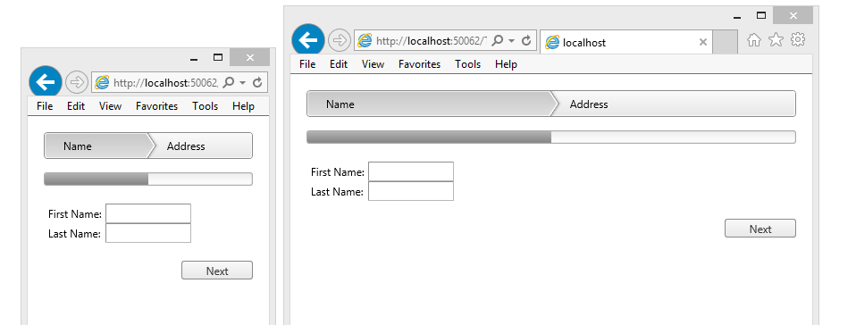

# Responsive Adaptive and Elastic Capabilities


This article explains the __responsive design capabilities RadWizard offers__.

Generally, responsive design means that the page and its content are able to adapt to different screen resolutions without deteriorating the user experience. This often includes changing the font size and having dimensions set in percent.

## Elastic Design with RadWizard
>caption Figure 1: Comparison between a RadWizard with the default 12px font size and with increased font-size


__RadWizard__ supports __changing the font size__ without breaking the control's appearance - if the new size is larger than the original, the elements in the control will simply increase their size as well to accommodate the text. This layout is achieved by using `em` units for setting dimensions and paddings in the control, instead of `px` because `em` units are tied to the font size. This allows dimensions and sizes to scale with the font size.

__Example 1:__ How to increase the font size of a RadWizard as shown in Figure 1.

````ASPNET
	    <style type="text/css">
	        div.RadWizard {
	            font-size: 24px;
	        }
	    </style>
	    <telerik:RadWizard ID="RadWizard3" runat="server">
	        <WizardSteps>
	            <telerik:RadWizardStep Title="Name">
	                <telerik:RadTextBox ID="RadTextBox1" Label="First Name:" runat="server"></telerik:RadTextBox>
	                <br />
	                <telerik:RadTextBox ID="RadTextBox2" Label="Last Name:" runat="server"></telerik:RadTextBox>
	            </telerik:RadWizardStep>
	            <telerik:RadWizardStep Title="Address">
	            </telerik:RadWizardStep>
	        </WizardSteps>
	    </telerik:RadWizard>
````


## Fluid Design with RadWizard
>caption Figure 1: RadWizard with dimensions set to 100% that occupies its entire parent element



You can set the __Width__ and __Height__ properties of the __RadWizard__ in __percent__. This lets it resize together with its parent element size.

__Example 2__: Markup and CSS that provide a fluid RadWizard that changes size with the browser viewport

````ASPNET
	     <telerik:RadWizard ID="RadWizard4" runat="server" Width="100%">
	        <WizardSteps>
	            <telerik:RadWizardStep Title="Name">
	                <telerik:RadTextBox ID="RadTextBox3" Label="First Name:" runat="server"></telerik:RadTextBox>
	                <br />
	                <telerik:RadTextBox ID="RadTextBox4" Label="Last Name:" runat="server"></telerik:RadTextBox>
	            </telerik:RadWizardStep>
	            <telerik:RadWizardStep Title="Address">
	            </telerik:RadWizardStep>
	        </WizardSteps>
	    </telerik:RadWizard>
````


## Adaptive Design with RadWizard

When the RenderMode is set to "Mobile" the __RadWizard__ supports __changing the rendering__ if user switch from portrait to landscape orientation or vice versa. More information about RadWizard adaptive design please find in the [ Mobile Rendering help article ]()
