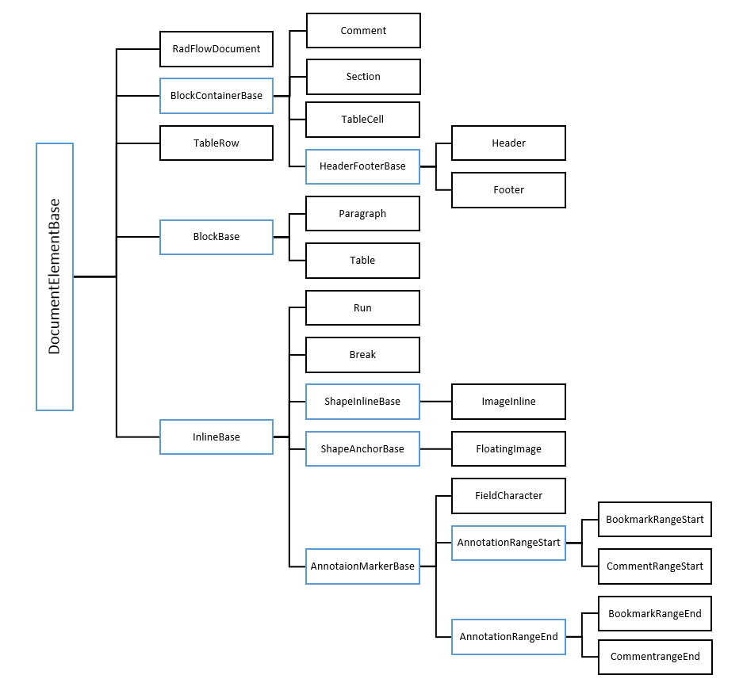

# Model

[RadFlowDocument](dd4dbe18-3a7a-4b31-a1e4-2b2ff6fba91e) describes flow document (document designed to dynamically adjust its layout according to the available size). This article explains in details the structure of __RadFlowDocument__'s document model.

## Document Elements

____RadFlowDocument can contain various types of document elements, all of them inheriting [DocumentElementBase ](http://www.telerik.com/help/wpf/t_telerik_windows_documents_flow_model_documentelementbase.html) abstract class. The hierarchy is presented in the following diagram, where abstract classes are denoted in blue:

Every document element is associated with an instance of __RadFlowDocument__ since its creation. This link is permanent and attempts to move document elements from one document to another result in exception; [cloning]() can be used instead to create deep copy of an element associated to another instance of RadFlowDocument. Current associated document is stored in the [Document](http://www.telerik.com/help/wpf/p_telerik_windows_documents_flow_model_documentelementbase_document.html) property.

## Composition of Document Elements

__RadFlowDocument__ represents a tree of document elements containing each other through a set of properties and collections. Possible containments are described in the following diagram, where document elements are denoted in black, collections in orange, and properties in green:

* RadFlowDocument contains collection of [Sections](http://www.telerik.com/help/wpf/p_telerik_windows_documents_flow_model_radflowdocument_sections.html).

* [Section](ca452231-3afc-45d0-b0f8-91404d6c52a2) contains collection of [Blocks](http://www.telerik.com/help/wpf/properties_t_telerik_windows_documents_flow_model_blockbase.html) (Paragraphs and Tables), as well as three Headers and three Footers – one default, one for even pages and one for first section page.

* [Paragraph](9d9b69ad-e25d-4dbf-b9ff-704390594da5) contains collection of [Inlines](http://www.telerik.com/help/wpf/properties_t_telerik_windows_documents_flow_model_inlinebase.html) – [Runs](9fefa02d-b368-4d24-a6fd-5047712117fb), [ImageInlines](7827a76c-d91f-485d-8891-255f6d9ab7b0), [FloatingImages](1f7c39c0-9e82-44ac-bbe1-fa2c9a30577d) and [FieldCharacters](e9cceb62-be40-480b-bc34-8a37c8d985e5).

* [Table](7f0b60cb-ecf1-4994-ba91-e979d1af4c8c) contains collection of TableRows.

* [TableRow](a37388da-0cc1-4529-9697-02e745cdb720)contains collection of TableCells.

* [TableCell](3d0bef98-f1d1-433d-a1d8-240c2a8e771b) contains collection of Blocks.

* [Headers and Footers](366488d1-9e4b-480d-ab11-ded987cb9f7d) contain collection of Blocks.

### Common ways for traversing the links between document elements

Relationships between document elements can be additionally traversed using:

* [Parent](http://www.telerik.com/help/wpf/p_telerik_windows_documents_flow_model_documentelementbase_parent.html) property. This property contains reference to document's parent and is automatically set when element is added/removed as a child of another element.

* [EnumerateChildrenOfType<T>](http://www.telerik.com/help/wpf/methods_t_telerik_windows_documents_flow_model_documentelementbase.html) method. This method can be used to recursively traverse document tree and return all children of given type __T__.

# See Also

 * [RadFlowDocument API Reference](http://www.telerik.com/help/wpf/allmembers_t_telerik_windows_documents_flow_model_radflowdocument.html)

 * [Clone and Merge]()
