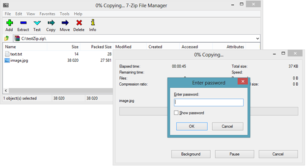

# Overview

##  

Have you ever wondered how to increase the responsiveness of your applications by compressing the data that you send over the internet? With the new __Zip Library__ you can compress data like images, docx or pdf files and send them over the wire. Thus, you will achieve fast and secure transactions.

This is a list with short descriptions of the top-of-the-line features of Telerik's __Zip Library__ control:

* __Easy to use API__: The __Zip Library__ exposes flexible and easy API to provide you with full control over the compressed data.

* __Load or create ZIP files__: You can load data from existing __ZIP__ files, create new ones and edit ZIPs that can be used by other applications. You can also create ZIP files in memory or add data to ZIP file from stream.

* __Store your data in the Isolated Storage__: You can store the compressed data in the Isolated Storage.

* __Support for large files__: The __Zip Library__ works seamlessly with large files.

* __Support for encryption__: You can protect your ZIP file with password for more security.

In order to use the ZipLibrary in your application, you need to add a reference to the **Telerik.Windows.Zip.dll** assembly. This is a cross-platform library that allows you to load, create and update ZIP archives on the fly and provides a convenient API to work with. The assembly will be automatically added to the Bin folder when you create a Telerik Web Forms site or you can manually find it in the AdditionalLibraries section in the Telerik UI for ASP.NET AJAX installation folder.
