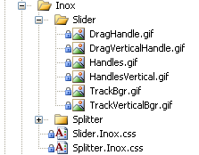

# How Skins Work

## Built-in skins

These are the skins provided by Telerik. Since Q3 2011 they are embedded in the Telerik.Web.UI.Skins.dll assembly as web resources (they were previously in the Telerik.Web.UI.dll assembly). To use a built-in skin the developer only needs to set the **Skin** property of the control. Non-embedded versions of the built-in skins are provided in "*C:\Program Files\Telerik\UI for ASP.NET AJAX suiteversion\Skins*" and in the **/Skins/** folder inside the Telerik UI for ASP.NET AJAX installation ZIP archive. The complete list of embedded skins is available below:

1. **Black**

1. **BlackMetroTouch**

1. **Bootstrap**

1. **Default**

1. **Glow**

1. **Metro**

1. **MetroTouch**

1. **Office2007**

1. **Office2010Black**

1. **Office2010Blue**

1. **Office2010Silver**

1. **Outlook**

1. **Silk**

1. **Simple**

1. **Sunset**

1. **Telerik**

1. **Vista**

1. **Web20**

1. **WebBlue**

1. **Windows7**

>important The **Bootstrap** skin has **no _font-size_** specified. This means that the Telerik UI for ASP.NET AJAX controls will inherit the font-size setting from the page (or their nearest parent element). This facilitates	customizations on the skin and integrating it in existing templates. Not all font-sizes may result in flawless appearance, however. The controls are tested with, and designed for **14px Arial** font.

>note The **Hay** , **Forest** , **Sitefinity** and **Transparent** skins are obsolete and have been removed from the Telerik.Web.UI.Skins.dll assembly as of **Q1 2014** .	You can find more information on the matter in [this blog post](http://blogs.telerik.com/aspnet-ajax/posts/13-04-11/6-telerik-asp.net-ajax-skins-going-obsolete).

## Custom skins

These are skins created by the developer. They are not embedded in the Telerik.Web.UI assembly, so the control cannot register them automatically. If you use a custom skin you need to set the **EnableEmbeddedSkins** property of the control to **false**, as well as set the **Skin** property to the name of the custom skin. If you do not do so, an exception will be thrown saying that there is no embedded skin matching the **Skin** property:

* *Telerik.Web.UI.RadSlider with ID='RadSlider1'* was unable to find embedded skin with name **'MySkin'**. Please, make sure that you spelled the skin name correctly, or if you want to use a custom skin, set **EnableEmbeddedSkins = false**.

## Modified built-in skins

It is possible to create a custom skin by taking an embedded one and making various adjustments. The non-embedded versions of the built-in skins are provided in the 'Skins' folder of the Telerik UI for ASP.NET AJAX install location. One can pick any skin for any control and modify some CSS rules. Then the resultant custom skin must be added to the website, the **EnableEmbeddedSkins** property of the control must be set to **false** and the modified CSS file must be manually registered in the ASPX page (or user control).

## Non-skinned controls

If you do not want a predefined skin for a control, set its **EnableEmbeddedSkins** property to **"false"**.

## Base stylesheets

Usually, a Telerik control has some collection of CSS styles, which should be applied regardless of the used skin (either built-in or custom). Such common CSS styles are included and registered on the page in a base stylesheet. In case you want to disable this automatic registration, set **EnableEmbeddedBaseStylesheet** to **false**.

## Skin folder structure

A skin consists of a CSS file and images. Here is a typical skin folder structure:

The CSS files are named in the following manner: **[Control].[Skin].css** e.g. **Slider.Glow.css**.

The images are stored in a folder named after the control.

The base stylesheets (if present as non-embedded files) are stored in the parent folder of all skin folders and are named after the control - e.g. Slider.css

>note For more information about Telerik controls skinning, we recommend watching the following video:
>[Skinning - Deep Dive for the Telerik UI for ASP.NET AJAX](http://tv.telerik.com/aspnet/webinar/skinning-deep-dive-radcontrols-aspnet-ajax)
>

