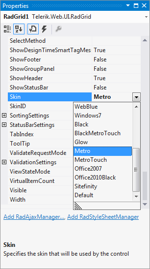
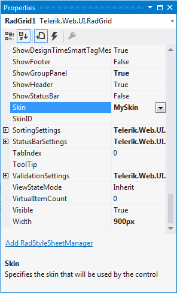

# Controlling Visual Appearance Overview


The visual appearance of Telerik UI for ASP.NET AJAX is defined through "skins". A skin consists of a CSS file and image	files (which are optional). Telerik UI for ASP.NET AJAX come with a set of built-in skins which are embedded in the	Telerik.Web.UI.Skins assembly and ready to be used. Developers can use the built-in skins as they are, or customize them.

## Using a skin

To use a skin you just need to set the __Skin__ property of the control to the designated skin name.Keep in mind that skin names are case-sensitive. You can set the Skin property declaratively, in design time or from code-behind.

>note  __Important !!!__ 
>If you are using a custom skin, you need to set the __EnableEmbeddedSkins__ property to __false__ .	If you don't do that, the control will try to register an embedded skin with the specified name and will fail with an exception.	For more information you can check the[How skins work]()and[Skin registration]()topics.
>


## Setting the skin from design time

To set the skin in design time you need to follow these steps:

1. Select the control of interest by clicking it.

1. Open its properties (either from the context menu or by pressing F4).

1. Find the __Skin__ property in the property grid (it is located in the "Appearance" category).

1. To use a built-in skin:

1. Open the drop-down control which contains all built-in skins.

1. Select a value from the drop-down to set that skin.

1. To use a custom (user-defined) skin:

1. Register the CSS file(s) of the skin to the Page (unless they are placed in an ASP.NET theme folder).

1. Set the __EnableEmbeddedSkins__ property to __false.__

1. Type the name of the skin in the text box.

## Setting the skin declaratively

To set the skin declaratively you need to set the __Skin__ attribute of the control tag. Keep in mind that it is case-sensitive.

<telerik:RadSlider ID="RadSlider1" __Skin="Outlook"__ runat="server" />

## Setting the skin from code-behind

To set the skin from code-behind you need to set the Skin property of the control to the designated value:

>tabbedCode

````VB.NET
	     
							<TelerikControl>.Skin = "Outlook"
				
````


````C#
	     
							<TelerikControl>.Skin = "Outlook";
				
````


>end

## Setting the skin globally from web.config

Review the bottom section of [this help topic]() for more details.

For more information about controls skinning, we recommend watching the following video:

[Skinning - Deep Dive for the Telerik UI for ASP.NET AJAX](http://tv.telerik.com/aspnet/webinar/skinning-deep-dive-radcontrols-aspnet-ajax)
