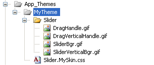

# Using Skins in ASP.NET Themes


Skins can be used along with ASP.NET themes.

## Using built-in skins

If you intend to use a built-in skin for your theme you need to set the Skin property of your control inside your *.skin file. For example if you have created a "MyTheme" theme and you wish to use the "Hay" skin of the slider add the following to the .skin file of your theme:

````ASP.NET
<telerik:RadSlider runat="server" Skin="Silk" />
````

Also don't forget the Register directive (you need only one per .skin file):

````ASP.NET
<%@ Register TagPrefix="telerik" Namespace="Telerik.Web.UI" Assembly="Telerik.Web.UI"%> 
````


## Using custom skins

If you have a custom skin, follow these steps:

1. This example assumes a custom skin for a RadSlider named "MySkin" and that you are creating a new theme called "MyTheme".

1. Copy the CSS file and all images in **~/App_Themes/MyTheme**


1. Create a .skin file which will contain the theme specific control settings.

1. Add the following in the newly created .skin file
````ASP.NET
<%@ Register TagPrefix="telerik" Namespace="Telerik.Web.UI" Assembly="Telerik.Web.UI" %> 
````

It is mandatory to set the **EnableEmbeddedSkins** property to **false** because "MySkin" is not one of the embedded skins. For more details see the [Creating a custom skin]() topic.

>important You **don't** need to manually register the CSS file of your custom skin when you are using ASP.NET themes. The framework will automatically register any CSS files found in the current theme folder (~/App_Themes/MyTheme).

>caution  **Internet Explorer limitation** 
>Note that Internet Explorer is unable to handle more than 31 CSS files on a page. If the ASP.NET theme contains more CSS files, you must combine them in some way, otherwise some of them will not be applied at all. In order to combine embedded CSS files, you can use [RadStyleSheetManager](http://www.telerik.com/help/aspnet-ajax/radstylesheetmanager.html).
>

