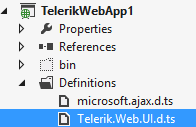
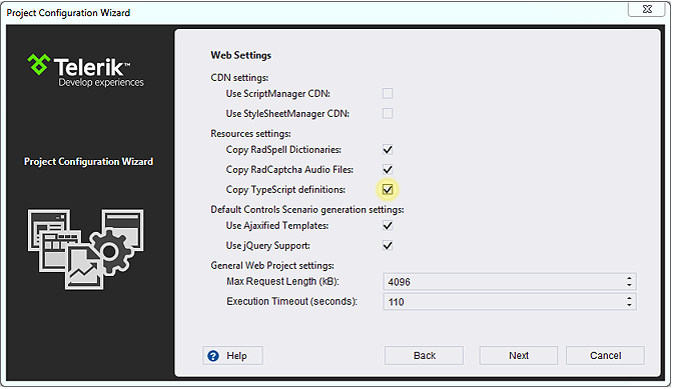

# Add TypeScript Definitions for the Telerik® UI for ASP.NET Ajax Suite

This article explains how to obtain and add the **TypeScript definitions**	available for the **Telerik® UI for ASP.NET Ajax** suite.

## Locating the TypeScript Definitions

As of **Q3 2014**, **TypeScript definitions** are available for the Telerik® UI for ASP.NET Ajax suite. They are located in the **TypeScriptDefinitions** folder in the installation directory (e.g.,*C:\Program Files (x86)\Progress\UI for ASP.NET AJAX RX YYYY\TypeScriptDefinitions*).

The folder contains the **Telerik.Web.UI.d.ts** file which holds the definitions for our objects and the **microsoft.ajax.d.ts** file for the MS AJAX framework objects. You can alternatively obtain the latter from the Internet in case Microsoft release an updated version.

## Adding the TypeScript Definitions Manually

**TypeScript** files need to be compiled to JavaScript files, so they are available only in **WebApplication** types of projects.

The following steps will guide you adding the **TypeScript** definitions in the application’s project:

1. Copy the **TypeScript** definitions from the *TypeScriptDefinitions* installation folder to your project.
	
	>caption Figure 1: Adding the Telerik TypeScript Definitions to your project.

	

1. Add a **TypeScript** file to your project. You can easily find it by using the *Search Installed Templates* textbox in the top right hand corner:
	
	>caption Figure 2: Adding a TypeScript file to the project.

	

	>tip If you do not see the **TypeScript** File option, you need to add **TypeScript** support to your Visual Studio by installing the [TypeScript Tools for Visual Studio](http://visualstudiogallery.msdn.microsoft.com/fa041d2d-5d77-494b-b0ba-8b4550792b4d). You may also find useful the [Web Essentials package](http://visualstudiogallery.msdn.microsoft.com/07d54d12-7133-4e15-becb-6f451ea3bea6) that adds similar features, including side-by-side TypeScript/JavaScript split screen.

1. For Visual Studio 2012 and 2013 versions prior to 2013 Update 2, you are likely to need to modify the *csproj / vbproj* fileto enable the **TypeScript** to JavaScript translation. To do this:

	1. Unload the project (right click on the solution and select Unload Project).

	1. Go to the project folder and open the `<projectName>.csproj / <projectName>.vbproj` file with a text editor.

	1. Add the following Import directive if you do not see it already.

		**XML**

			<import project="$(VSToolsPath)\TypeScript\Microsoft.TypeScript.targets" condition="Exists('$(VSToolsPath)\TypeScript\Microsoft.TypeScript.targets')" />

	1. Reload the project into Visual Studio.This should allow your Visual Studio to compile the **TypeScript** files to JavaScript files with the same name when you save them.

1. Reference the JavaScript files that will be generated on your page. To do this, simply replace the **.ts** extension with **.js**. The generated *.js* file will be excluded by the solution by default:

	>caption Figure 3: Referencing a JavaScript file generated by a TypeScript file.
	
	

1. Write your code as if it were in a standard JavaScript file. This means that you cannot use server code blocks and that browsers will tend to cache this file, so you need to do a full reload (usually Ctrl+F5) to get the new version.

## Adding the TypeScript Definitions from the Configuration Wizard

When you create a Web Application with the help of the [Telerik Creation and Configuration Wizard](), you can add the **TypeScript** definitions needed with a single click of a checkbox.

>caption Figure 4: Using Configuration Wizard to add TypeScript definitions to the project.

### See Also

 * [What is TypeScript]()

 * [Use TypeScript for the Telerik® UI for ASP.NET Ajax Suite]()
