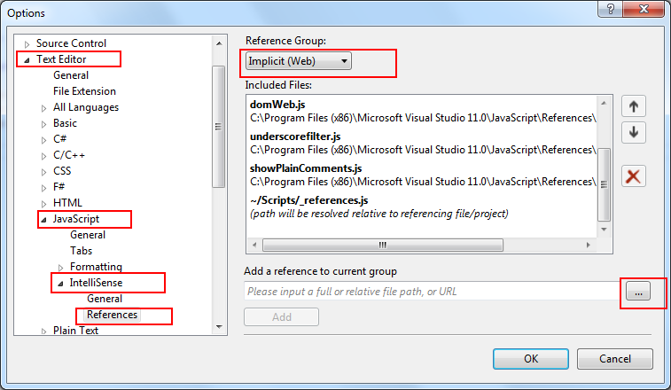
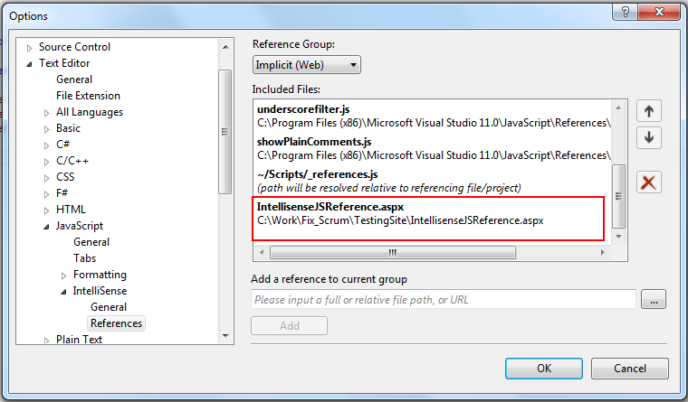

# jQuery Intellisense


This article shows how to enable the IntelliSense of the embedded in Telerik.Web.UI assembly jQuery library.

Separate sections below explain the cases for the different Visual Studio versions and Telerik.Web.UI versions.

## jQuery IntelliSense in VS 2012 and VS 2013 using Telerik® UI for ASP.NET Ajax Q3 2012 or later

>note IntelliSense will not work if **RadScriptManager** is used instead of ScriptManager. For all intents and purposes,the reference to the later seems to be hard coded in Visual Studio. So, when you write your code you can use the ScriptManagerto get the intellisense working and when ready - replace the ScriptManager with **RadScriptManager** .

The following simple markup provides IntelliSense for the current page:

````ASP.NET
<asp:ScriptManager ID="ScriptManager2" runat="server">
    <Scripts>
        <asp:ScriptReference Assembly="Telerik.Web.UI" Name="Telerik.Web.UI.Common.Core.js" />
    </Scripts>
</asp:ScriptManager>
````

You can also enable it for all pages by creating a custom page and adding it to the VS settings:

1. Create a sample aspx page (e.g. IntellisenseJSReference.aspx) with the following mark up:

	**ASP.NET**
	
		<asp:ScriptManager runat="server" ID="ScriptManager3">
		   <Scripts>
			   <asp:ScriptReference Assembly="Telerik.Web.UI" Name="Telerik.Web.UI.Common.Core.js" />
			   <asp:ScriptReference Assembly="Telerik.Web.UI" Name="Telerik.Web.UI.Common.jQuery.js" />
			   <asp:ScriptReference Assembly="Telerik.Web.UI" Name="Telerik.Web.UI.Common.jQueryInclude.js" />
		   </Scripts>
		</asp:ScriptManager> 

1. Go to Tools -> Options, find TextEditor -> JavaScript -> IntelliSense -> References menu. Set Reference Group to Implicit(Web):

	

1. Add the created aspx page as a reference and click OK:

	

1. Go to sample page and test the javascript intellisense

	

## jQuery IntelliSense in VS 2010 using Telerik® UI for ASP.NET Ajax Q2 2011 SP1 or later

Since the Q2 2011 SP1 release of Telerik® UI for ASP.NET Ajax, IntelliSense is automatically enabled when RadScriptManager is on a page. There is no need to add the previously required ScriptReferences to RadScriptManager to enable IntelliSense:

````ASP.NET
<telerik:RadScriptManager runat="server" ID="RadScriptManager1">
</telerik:RadScriptManager> 
````

If you have been using the script references before, you can safely remove them with the new release:

````ASP.NET
You no longer need these for jQuery intellisense
<Scripts>
    <asp:ScriptReference Assembly="Telerik.Web.UI" Name="Telerik.Web.UI.Common.Core.js" />
    <asp:ScriptReference Assembly="Telerik.Web.UI" Name="Telerik.Web.UI.Common.jQuery.js" />
    <asp:ScriptReference Assembly="Telerik.Web.UI" Name="Telerik.Web.UI.Common.jQueryInclude.js" />
</Scripts>
````

## jQuery IntelliSense in VS 2008 using Telerik® UI for ASP.NET Ajax Q1 2011 or later

Since the Q1 2011 release of Telerik® UI for ASP.NET Ajax, jQuery IntelliSense does not work with the scripts embedded in the Telerik.Web.UI.dll. The relevant jQuery scripts can be referenced as external files similarly to the following:

````ASP.NET
<asp:ScriptManager ID="ScriptManager1" runat="server">
    <Scripts>
        <asp:ScriptReference Assembly="Telerik.Web.UI" Name="Telerik.Web.UI.Common.Core.js" />
    </Scripts>
</asp:ScriptManager>
````

## Enable jQuery Intellisense using Telerik® UI for ASP.NET Ajax Q1 2009 SP1 or higher

1. Install Visual Studio 2008 SP1

2. Install VS 2008 [Patch KB958502](http://connect.microsoft.com/VisualStudio/Downloads/DownloadDetails.aspx?DownloadID=14883) to Support *"-vsdoc.js"* Intellisense Files

3. Add the following script references in your page:

	**ASP.NET**
	
		<asp:ScriptManager runat="server" ID="ScriptManager1">
		   <Scripts>
			   <asp:ScriptReference Assembly="Telerik.Web.UI" Name="Telerik.Web.UI.Common.Core.js" />
			   <asp:ScriptReference Assembly="Telerik.Web.UI" Name="Telerik.Web.UI.Common.jQuery.js" />
			   <asp:ScriptReference Assembly="Telerik.Web.UI" Name="Telerik.Web.UI.Common.jQueryInclude.js" />
		   </Scripts>
		</asp:ScriptManager> 

>note IntelliSense will not work if **RadScriptManager** is used instead of ScriptManager. For all intents and purposes, the reference to the later seems to be hard coded in Visual Studio. So, when you write your code you can use the ScriptManager to get the intellisense working and when ready - replace the ScriptManager with **RadScriptManager** 

Here is a screenshot:


## Enable jQuery Intellisense using Telerik® UI for ASP.NET Ajax version Q3 2008

1. Install Visual Studio 2008 SP1

2. Install VS 2008 [Patch KB958502](http://connect.microsoft.com/VisualStudio/Downloads/DownloadDetails.aspx?DownloadID=14883) to Support "-vsdoc.js" Intellisense Files

3. Download the [jQuery IntelliSense documentation file](http://code.google.com/p/jqueryjs/downloads/detail?name=jquery-1.2.6-vsdoc.js) and add it to your project. Rename it to **jquery-telerik-vsdoc.js**

4. Add a new file to your project, **jquery-telerik.js**, with the following content:

	**JavaScript**
	
		var jQuery = window.jQuery = window.$ = $telerik.$;

	This will make jQuery accessible under its default alias - $.

	Make sure that both jquery-telerik.js and jquery-telerik-vsdoc.js are in the same folder.

5. Add script references for jQuery and the jquery-telerik.js file in the ScriptManager on the page:

	**ASP.NET**

		<asp:ScriptManager ID="ScriptManager" runat="server">
		   <Scripts>
			   <asp:ScriptReference Assembly="Telerik.Web.UI" Name="Telerik.Web.UI.Common.Core.js" />
			   <asp:ScriptReference Assembly="Telerik.Web.UI" Name="Telerik.Web.UI.Common.jQuery.js" />
			   <asp:ScriptReference Path="~/jquery-telerik.js" />
		   </Scripts>
		</asp:ScriptManager> 

### See Also

 * [What is jQuery?]()

 * [Using jQuery]()
