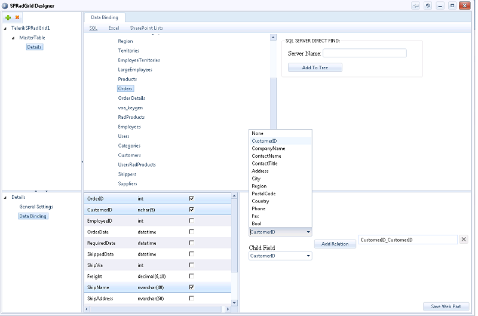
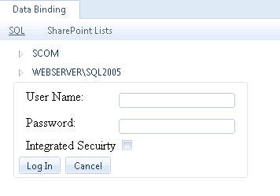
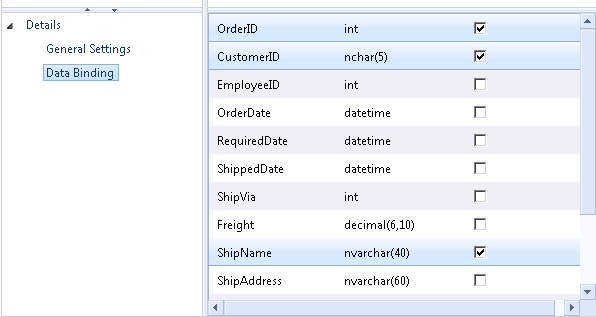
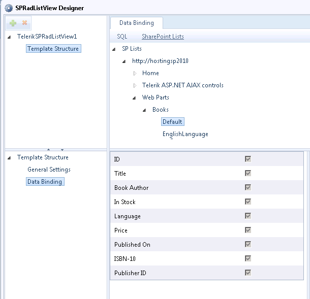
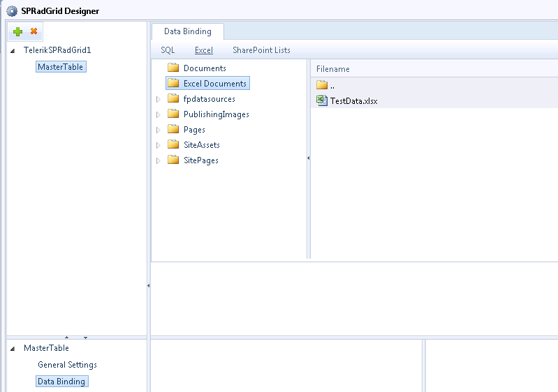

# Designer and Data Binding

## SPRadGrid Designer

The TelerikSPRadGrid Web Part features a structure-and-data __designer__ that makes it possibleto display and manipulate data coming from tables lying on __SQL Server____databases__, __Excel files (no hierarchy supported)__ within document libraries and __SharePoint lists__ either in a flat or hierarchical form. (see [Hierarchical Data]() for more information)

To employ the designer’s capabilities you need to first load it through the Web Part’s menu:
>caption 

The SPRadGrid designer is very similar in logic and organizationto RadGrid's Visual Studio designer. It provides the option to construct the general structure of the grid adding/deleting detail table views, set some important properties for the latter(such as Paging, Filtering, Sorting and others) and specify the data source to which the table views should be bound.
>caption 

To start constructing with SPRadGrid designer, first select a table view from the upper-left tree. The bottom right one is now loaded with two options to select from: __General Settings__ and __DataBinding__:
>caption 

Clicking upon the __General Settings__ node will allow you to set the most important properties for the selected table view. Do note that the __Client Row Selection & Columns Reorder__ features areenabled/disabled on the grid, not table-view level, and will be delegated accordingly to the master and detail tables.
>caption 

The other option in the bottom left region will load the SQL, Excel and SP lists explorers into the top right pane. Each one of those is hosted within a separate tab with a relevant name:
>caption 

## Binding to SQL

Selecting the __SQL__ tab will display a basic __SQL Server Instances Explorer__,again in the structure of a tree view control.When an instance of an SQL server is chosen as the data source for a given table view, the user will be prompted to provide his/her credentials before being able to browse the server's content:
>caption 

The next level in the tree will list the databases under the SQL server instance.Still on the next level all the tables within a given database will be enumerated.__Important:____Clicking upon a table is the only action that tells the designer to assign it to the selected table-view as its underlying data source.__ Therefore, it is also the only way to change the underlying database table for the currently selected grid table view. Afterwards, the designer will display in the bottom right splitter region a grid control listing the database table columns:
>caption 

Now you have the opportunity to select the columns you’d like to see displayed in the web part. If no columns are selected, no table view will be constructed and any detail tables under it will be skipped by the designer too.

## Binding to SharePoint Lists

Selecting the SharePoint Lists tab will display the SP Lists Explorer. The topmost nodes give you the site collections, with each one's web sitesfollowing. Clicking on a web site will display its lists and selecting one of the latter will enumerate the views associated with that list:
>caption 

No log-in credentials will be required when binding to SP Lists as the current user's account is taken into consideration. Furthermore, no columns are selected for the SP list chosen, but instead the deepest level in the __SP Lists Explorer__tree will be populated with the views of the corresponding list. All the columns in the selected view will, upon saving the web part’s settings, become columns of SPRadGrid.

__Note:__The SPRadGrid Web Part allows you to display and edit data coming from __external__ SharePonit Lists as well. Those are treated by SharePoint as regular SharePoint lists and as such are part of a given SharePoint site/subsite. Therefore, TelerikSPRadGrid will list them in the ToolPart list combo or the SPRadGrid Designer SPLists explorer tree along with the regular SharePonit lists and you can pick one from there to bind SPRadGrid to the external data store. Any change to the data in the SPRadGrid control will be automatically reflected into the external data provider.

## Binding to Excel

SPRadGrid also gives you the opportunity to bind the grid control to data from an excel file loaded into a SharePoint document library. To do so, choose the MasterTableViewNode from the grid structure tree in the top left corner and go to the Excel tab of the top right splitter pane of SPRadGrid Designer to load the Excel file explorer:
>caption 

The Excel explorer lists the folders within the document libraries only for the current web-site which the SPRadGrid web part's containing page belongs to. Upon choosing an excel file a little panel will be displayed that prompts for a cell range and a sheet name:
>caption 

__Important: Only when the OK button has been hit, the excel file with the accompanying information will be assigned as the data-source for the MasterTableView.__The first row in the chosen range will be treated as containing the column names for the excel table to be displayed. If this row is empty, default column names will be assigned.

__Note:__ it might take some time for the sheet names to load as the SharePoint Excel Service is used for that behind the scene.

Once the range and the sheet name have been specified, just press the Save Web Part button.

On a final note, let us be aware that the SPRadGrid Designer does not preclude the use of the Web Part's Tool Part and it has been left as an additional option if you need to bind the grid control to just a single SharePoint list without opening the designer. (For more information on that see [SPRadGrid ToolPart Configuration]())

To see a live example of the above-described functionality, please, visit [http://telerik.sharepoint.com](http://telerik.sharepoint.com) at the WebParts -> Telerik SPRadGrid Hierarchy\Excel Binding pages.
