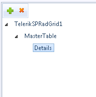
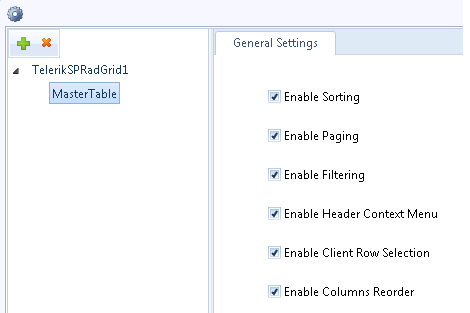

# Hierarchical Data

## 

SPRadGrid Designer makes it possible to manipulate a __hierarchy__ of data coming from tables lying on __SQL Server____databases__and __SharePoint lists__. Please, go through the [ SPRadGrid Designer and SQL/Excel/SPList Binding]() topic for general instructions on working with the the designer.

The Web Part designer provides the option to construct the general hierarchical structure of the grid. You have the opportunity to add/delete detail table views from the tool bar above the top left tree view:
>caption 

To set the most important properties of for each table view (such as Paging, Filtering, Sorting and others)choose it from the top left grid structure tree, select the General Settings node from the lower left splitter paneand work with the General Properties tab that should appear in the top right of the Designer:
>caption 

Use the SQL/Excel/SPList Explorers to select the underlying data-source for each table view as described in the [ SPRadGrid Designer and SQL/Excel/SPList Binding]() topic.

If the currently selectedgrid table view is a detail one you will be given the additional option to specify master-child relations:
>caption 

Choose an item from the master-field combo, related to one from the child field drop-down and hit the Add Relation button. If you need to specify multiple-field	relations, just repeat the steps above.

__Note:__hierarchical data is not supported with Excel binding.

To see a live example of the above-described functionality, please, visit [http://telerik.sharepoint.com](http://telerik.sharepoint.com) at the WebParts -> Telerik SPRadGrid Hierarchy page.
