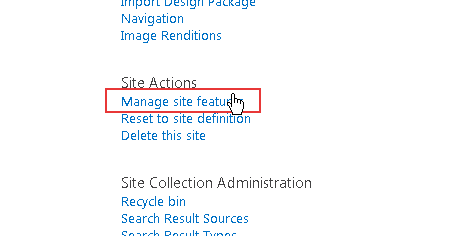
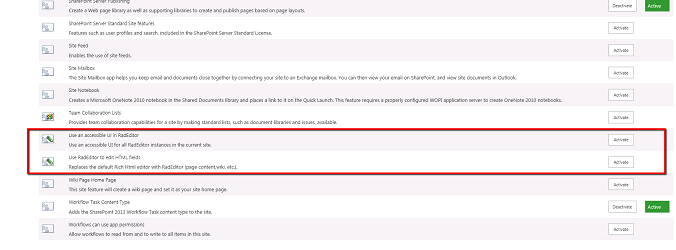
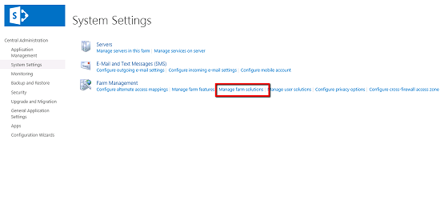
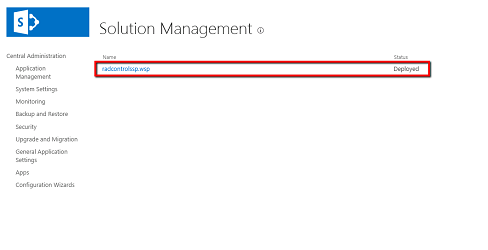
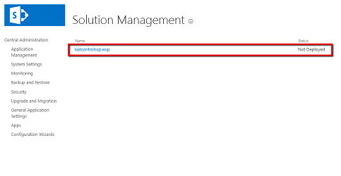
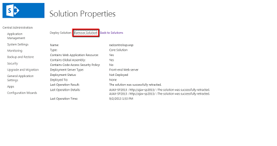

# Uninstalling


## Uninstalling RadEditor

In general, there are 2 approaches for uninstalling Telerik controls for SharePoint 2013. You could do that either by

1. Using the MS Windows’ Control Panel / Add Remove Programs (Programs and Features in Windows7)OR

1. By using SharePoint’s Central Administration page.

The information below provides details about the second approach. **Still, we strongly recommend following points 1 to 3(inclusive) from the "uninstall Telerik RadEditor from your SharePoint 2013 site" section, when uninstalling the controls via the MS Windows Control Panel applet**.

In order to uninstall SharePoint 2013 you need to first perform the following preliminary tasks. Note that these tasks are needed ONLY if you do not plan to upgrade to a newer version of SharePoint 2013 (e.g. you wish to use only the default SharePoint editor again):

1. Revert to the default rich-text editor in Web Content Management scenario (do the reverse actions of the ones described in [Using RadEditor in Web Content Management scenario]()).

1. Open the page(s) in which you have used RadEditor for SharePoint 2013.

1. Replace the RadEditor tags (telerik:RadHtmlField) with the default editor tags:
````ASP.NET
<PublishingWebControls:RichHtmlField  runat="server" id="Richhtmlfield1" FieldName="..." />
````

1. Remove the RadEditor registration line from the top of the page:
````ASP.NET
<%@ Register TagPrefix="telerik" Namespace="Telerik.SharePoint.FieldEditor" Assembly="RadEditorSharePoint, Version=x.x.x.x, culture=neutral, PublicKeyToken=1f131a624888eeed" %>
````

1. Replace all instances of the RadEditor Web Part with the default rich-text editor Web Part:

1. Open a given page for editing

1. Copy the content of a given RadEditor Web Part

1. Delete this RadEditor Web Part

1. Place a default rich-text editor Web Part on its place

1. Paste to copied content inside the Web Part and save it

1. Repeat these steps for all RadEditor Web Parts on the page

1. Once you have performed the steps described above, please do the following to **uninstall Telerik RadEditor from yourSharePoint 2013 site**:

1. Open your SharePoint site in the browser. From the Site Actions menu go to Site Settings

1. Click Manage site features link from the Site Actions section.

1. Scroll to the bottom of the list and deactivate the RadEditor features.

1. Open the SharePoint Central Administration page.

1. Go to the System Settings and click on Manage farm solutions link from the Farm Management section.


1. You should see the radcontrolssp.wsp solution in the list. Click on the name link to go to the Solution Properties page.


1. Choose Retract Solution. On the next page choose when and from which solutions to retract the RadEditor. Then click Ok.


1. Wait a few minutes. Then refresh the page. The retraction process should be over and you should see the following screen:


1. Click the name link to open the Solution Properties page again. This time click the Remove Solution button. Then confirm in the dialog box. The solution should be removed from the farm and a confirmation screen will be displayed.

